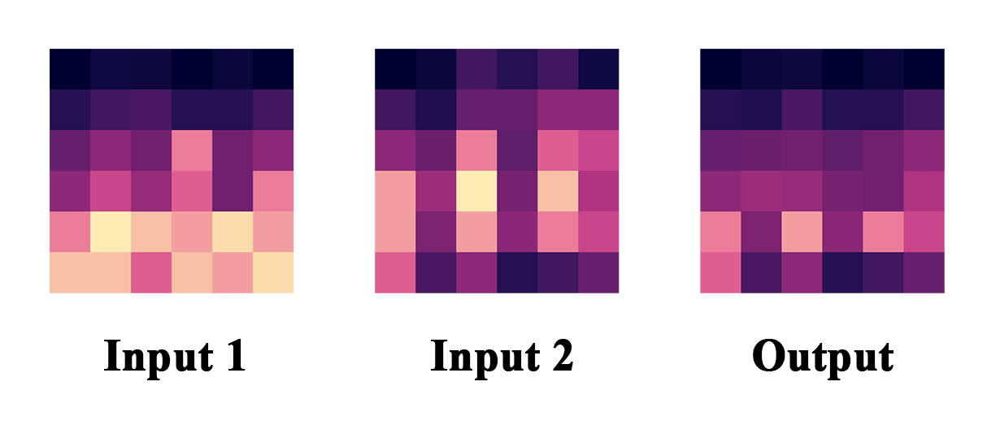

# SpecBlender

A Rust-based spectral sound processing toolkit using STFT. This contains some algorithms from [spec_utils.py](https://github.com/Anjok07/ultimatevocalremovergui/blob/5517e0cf0d1acd16a1618eeedec596957523f9e1/lib_v5/spec_utils.py#L466). Compared to the Python version, the Rust implementation runs faster. For example, min-mag runs three times faster (on a Ryzen 7).

## Requirements

FFmpeg must be available in PATH

## Usage

```bash
specblender [ALGORITHM] input1.wav input2.wav output.wav [OPTIONS]
```

## Algorithms

### **min-mag** (Default)
Minimum magnitude spectral blending. Merges two audio files by selecting the quieter spectral components at each frequency bin.



### **max-mag** 
Maximum magnitude spectral blending. Selects the louder spectral components at each frequency bin.

### **sub**
Spectral subtraction (input1 - input2).  It works like an [Invert_p](https://github.com/Anjok07/ultimatevocalremovergui/blob/5517e0cf0d1acd16a1618eeedec596957523f9e1/lib_v5/spec_utils.py#L476C24-L476C32).

### **copy-phase**
Copies phase information from input1 to the magnitude of input2.

## Options

| Option | Description |
|--------|-------------|
| `--mono` | Export mono output (average of both channels) |
| `--mono-post` | Process stereo, then mix to mono (matches manual mixing) |
| `--n_fft=N` | FFT window size (default: 2048, range: 32-65536) |
| `--hop=H` | Hop length in samples (default: 512, must be ≤ n_fft) |
| `--window=TYPE` | Window function: `hann` or `hamming` (default: hann) |
| `--stft=MODE` | STFT processing mode: `single` or `multi` (default: single) |
| `--streaming=MODE` | Streaming mode: `off`, `on`, `auto` (default: auto) |
| `--pcm_type=TYPE` | PCM output format: `pcm24` or `float32` (default: float32) |
| `--phase=SOURCE` | Phase source control: `auto`, `input1`, `input2` (default: auto) |

### STFT Modes

- **`single`** (default) - Standard STFT processing
- **`multi`** - Multi-resolution processing:
  - Low frequencies: FFT=4096 for better frequency resolution
  - High frequencies: FFT=1024 for better time resolution
  - Intelligent frequency band blending via FFmpeg filters

### Streaming Mode
- `--streaming=off` - Process entire file in memory (more memory usage)
- `--streaming=on` - Process in chunks (constant memory usage)  
- `--streaming=auto` - Automatically use streaming for files longer than 10 minutes

### PCM Output Format
- `--pcm_type=float32` - 32-bit floating point WAV (default, maximum quality)
- `--pcm_type=pcm24` - 24-bit integer PCM WAV (smaller file size)

### Phase Control

- **`auto`** (default) - Use phase from signal with appropriate magnitude (algorithm-dependent)
- **`input1`** - Always use phase from first input file
- **`input2`** - Always use phase from second input file

## Building from Source

```bash
git clone https://github.com/aufr33/specblender
cd specblender
cargo build --release
```
